# Crust Network Milestone Deliverables

## Open Source Repos

- [Crust](https://github.com/crustio/crust)  
  The chain node which implement Crust protocol based on substrate.
- [Crust sWorker](https://github.com/crustio/crust-sworker)  
  Offchain storage work inspector based on TEE technology.
- [Crust API](https://github.com/crustio/crust-api)  
  The middleware layer connecting sWorker and Chain Node.
- [Crust Node](https://github.com/crustio/crust-node)  
  Official crust node service for running Crust protocol.
- [Crust Apps](https://github.com/crustio/crust-apps)  
  A Portal into the Crust network based on [@polkadot/apps](https://github.com/polkadot-js/apps). Provides a view and interaction layer from a browser.

## M1 Deliverables

| Number | Deliverable                                                                                                                                                                                            | Link                                                                                                                     | Notes                                                                                                                                                                            |
|--------|--------------------------------------------------------------------------------------------------------------------------------------------------------------------------------------------------------|--------------------------------------------------------------------------------------------------------------------------|----------------------------------------------------------------------------------------------------------------------------------------------------------------------------------|
| 1      | Users will be able to **check Crust nodes' empty and meaningful storage volume and status** through Crust Apps.                                                                                    | [Look through Work Report](#1-look-through-work-report)                                                                                                 | MPoW-1: work report runtime module to quantify storage volume and monitor storage status.                                                                                        |
| 2      | Users will be able to **see nodes' TEE identity** through Crust Apps.                                                                                                                              | [Look through TEE Identity](#2-look-through-tee-identity)                                                                                                | MPoW-2: TEE (SGX solution) node onboarding and on-chain verification, nodes with SGX CPU can join Crust network                                                                  |
| 3      | Once nodes’ physical storage space changes, node owners will be able to **see nodes' storage volume automatically changes next era** through Crust explorer.                                           | [Dynamic storage change](#3-look-through-work-reports-change-when-increasing-or-reducing-storage-volumn)                                                                     | MPoW-3: dynamic storage scaling feature (including both empty and meaningful storage) to improve network availability                                                            |
| 4      | Users will be able to **check nodes’ (both validators and candidates) stake limit and valid stake** through Crust Apps.                                                                            | [Look through stake limit and valid stake](#4-validator-will-be-able-to-see-its-stake-limit-and-valid-stakes)                                                                                 | GPoS-1: Implement the feature to set stake limitation based on storage volume reported by MPoW work report.                                                                      |
| 5      | Users will not be able to **stake/vote exceed any node’s staking limit at any time**, and a node will **not be able to become a validator with no stake limit** claimed.                               | [Active check](#5-active-check-based-on-stake-limit)                                                            | GPoS-2: Implement active stake check based on validators and guarantors’ actions                                                                                                 |
| 6      | Users should be able to **see validator's stake limit (maybe) changed** and so his **valid stake  and his guarantor's valid stake (maybe) changed in each new era begins** through Crust Apps.     | [Passive check](#6-passive-check-based-on-stake-limit) | GPoS-3: Implement passive stake check. At the end of each era, while nodes’ stake limit could be changed according to factors like whole network storage volume and local volume |
| 7      | Users will be able to **see validator set changes(from stakes high to low order) at each era** through Crust Apps.                                                                                 | [Validator election algorithm](#7-validator-election-algorithm)                     | GPoS-4: Implement validator set election algorithm, it selects validators from high to low according to the nodes’ total stakes.                                                 |
| 8      | Users will be able to **get/put files through Crust Maxwell’s storage interfaces**. In addition, users will be able to **see the meaningful storage volume changes** accordingly through Crust explorer. | [Provide storage interface to store give file](#8-providing-storage-interface-to-store-given-file)              | Storage-1: Provide basic meaningful storage capabilities. Storage API will be finalized in M2. In M1 will provide basic FastDFS interfaces.                          |
| 9 | Finish **technical white paper** and publish on Crust website |  [Technical white paper](https://crust.network/whitePaper) | Documentation-1 |
| 10 | Provide **wiki** on how to explore Maxwell on GitHub. | [Crust Maxwell Wiki](https://github.com/crustio/crust/wiki/Maxwell-1.0-User-Guide) | Documentation-2 |
| 11 | Provide a basic **Github action** including building and testing on Ubuntu in crustio/crust repo | [Crust Github Action](https://github.com/crustio/crust/actions) | Open Source-1 |
| 12 | Provide a basic **Github action** building on Ubuntu in crustio/crust-sworker repo | [Crust sWorker Github Action](https://github.com/crustio/crust-sworker/actions?query=workflow%3ACI) | Open Source-2 |
| 13 | Provide a basic **Github action** including building on Ubuntu in crustio/crust-api repo | [Crust API Github Action](https://github.com/crustio/crust-api/actions?query=workflow%3A%22Yarn+CI%22) |Open Source-3

## Testing Guide

This document will guide you to build Crust source code, run a node connected with [Crust Maxwell 1.0 Open TestNet](https://github.com/crustio/crust/wiki/Maxwell-1.0-User-Guide), and test M1 features.

### 1. Build

You can either build Crust docker images from source, or pull official images from Docker Hub.

#### Pull from docker hub

You can run following command to pull the official images from [Docker Hub](https://hub.docker.com/u/crustio).

```shell
sudo docker pull crustio/crust:0.7.0
sudo docker pull crustio/crust-sworker:0.5.0
sudo docker pull crustio/config-generator:0.1.0
sudo docker pull crustio/karst:0.2.0
sudo docker pull crustio/crust-api:0.5.0
```

#### Build docker from source

Crust includes 5 major modules, please clone and checkout to `release/*` branch to build docker images:

- **Crust**:
  1. `git clone https://github.com/crustio/crust.git`
  2. `cd crust`
  3. `git checkout release/0.7.0`
  4. Run docker build refer to this [doc](https://github.com/crustio/crust/blob/release/0.7.0/docker/README.md)
- **Crust sWorker**:
  1. `git clone https://github.com/crustio/crust-sworker.git`
  2. `cd crust-sworker`
  3. `git checkout release/0.5.0`
  4. Run docker build refer to this [doc](https://github.com/crustio/crust-sworker/blob/release/0.5.0/docs/Docker.md#build)
- **Karst**:
  1. `git clone https://github.com/crustio/karst.git`
  2. `cd karst`
  3. `git checkout release/0.2.0`
  4. Run docker build refer to this [doc](https://github.com/crustio/karst/blob/release/0.2.0/docs/docker.md#build-image).
- **Crust API**:
  1. `git clone https://github.com/crustio/crust-api.git`
  2. `cd crust-api`
  3. `git checkout release/0.5.0`
  4. Run docker build refer to this [doc](https://github.com/crustio/crust-api/blob/release/0.5.0/docs/docker.md)
- **Crust Config Generator**:
  1. `git clone https://github.com/crustio/crust-node.git`
  2. `cd crust-node`
  3. `git checkout w3f/m1`
  4. Run docker build refer to this [doc](https://github.com/crustio/crust-node/blob/master/generator/README.md)

### 2. Run

> ***IMPORTANT NOTES***:  
> 1. We have already created 4 accounts for W3F and transfered some CRUs in: `W3F V Controller`, `W3F V Stash`, `W3F G Controller` and `W3F G Stash`.  
> 2. You can use these 4 accounts directly and begin from step ["3.3 Bond" of Node Setup Manual](https://github.com/crustio/crust/wiki/Maxwell-1.0-Node-Setup#33bond).  
> 3. To simplify the test process, we strongly recommend that you `bond` with `400 CRUs` and preparing `10GB` initial storage volume for `srd_init_capacity` in the step ["5.1 Config node setting" of Node Setup Manual](https://github.com/crustio/crust/wiki/Maxwell-1.0-Node-Setup#51-config-node-setting)

Please refer to the [Node Setup Manual](https://github.com/crustio/crust/wiki/Maxwell-1.0-Node-Setup).

### 3. Test M1 deliverables

#### 1. Look through work report

**Use validator accounts:**

- Step1 - Make sure you have already started [Crust sWorker](https://github.com/crustio/crust/wiki/Maxwell-1.0-Node-Setup#63-start-sworker) and see your work report uploaded
- Step2 - You can see the work report from Chain state in [Crust Apps](http://apps.crust.network/#/chainstate), like the pic shows below

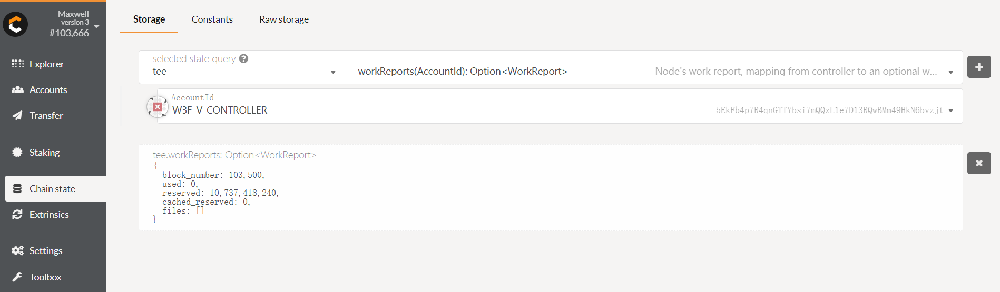

#### 2. Look through TEE identity

**Use validator accounts:**

- Step1 - Make sure you have already started [Crust sWorker](https://github.com/crustio/crust/wiki/Maxwell-1.0-Node-Setup#63-start-sworker)
- Step2 - You can see the sWorker identity from Chain state in [Crust Apps](http://apps.crust.network/#/chainstate), like the pic shows below

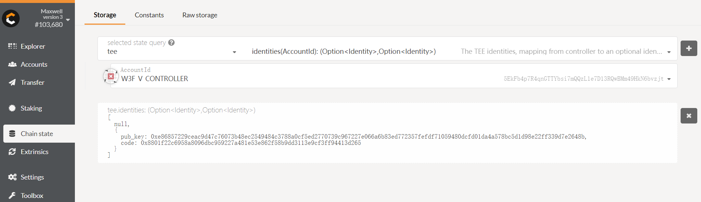

#### 3. Look through Work report's change when increasing or reducing storage volumn

**Use validator accounts in following steps.**

- Increasing storage  
  - Step1 - Run command below to increase 10GB storage

  ```shell
  curl --location --request POST 'http://127.0.0.1:12222/api/v0/srd/change' --header 'backup: {"address":"5EHP5jLDdyNevsXhvJBwo18srU95ijYoWH42C4TqYPpmeVP7","encoded":"0xdfaabf5fda7c134549bc8a6fefe8cc3ff8bc6b1c3885ae50ec2e2f64cf20ebbbefd34c79715e4722443b205e62cfb9fd1bfca61e7cd036599a90587a7dd2d62f352abf9f3799dd7ce1853474cfe23cd5f9b4b6e999b338005bf98ee545b24515e22152a1923660876330f776fc5fad1f4e47ee147de6e2f087a038413aa6bd21519fb9bb19bbd193bcbe9b5fd40ad9508b0d82e93b2e56aeec7c84945c","encoding":{"content":["pkcs8","sr25519"],"type":"xsalsa20-poly1305","version":"2"},"meta":{"genesisHash":"0xa5bec4b73f15b4f6e99eee42778ab6754c90aeadcd2ae86aa79e9c5c7a55dd30","name":"W3F V Controller","tags":[],"whenCreated":1596619069134}}' --header 'Content-Type: application/json' --data-raw '{"change":10}'
  ```

  - Step2 - **After 1 era**, you can see the new work report from Chain state in [Crust Apps](http://apps.crust.network/#/chainstate)
  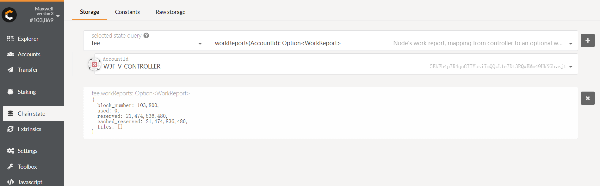

- Decreasing storage
  - Step1 - Run command below to decrease 10GB storage

    ```shell
    curl --location --request POST 'http://127.0.0.1:12222/api/v0/srd/change' --header 'backup: {"address":"5EHP5jLDdyNevsXhvJBwo18srU95ijYoWH42C4TqYPpmeVP7","encoded":"0xdfaabf5fda7c134549bc8a6fefe8cc3ff8bc6b1c3885ae50ec2e2f64cf20ebbbefd34c79715e4722443b205e62cfb9fd1bfca61e7cd036599a90587a7dd2d62f352abf9f3799dd7ce1853474cfe23cd5f9b4b6e999b338005bf98ee545b24515e22152a1923660876330f776fc5fad1f4e47ee147de6e2f087a038413aa6bd21519fb9bb19bbd193bcbe9b5fd40ad9508b0d82e93b2e56aeec7c84945c","encoding":{"content":["pkcs8","sr25519"],"type":"xsalsa20-poly1305","version":"2"},"meta":{"genesisHash":"0xa5bec4b73f15b4f6e99eee42778ab6754c90aeadcd2ae86aa79e9c5c7a55dd30","name":"W3F V Controller","tags":[],"whenCreated":1596619069134}}' --header 'Content-Type: application/json' --data-raw '{"change":-10}'
    ```

  - Step2 - **After 1 era**, you can see the new work report from Chain state in [Crust Apps](http://apps.crust.network/#/chainstate)
  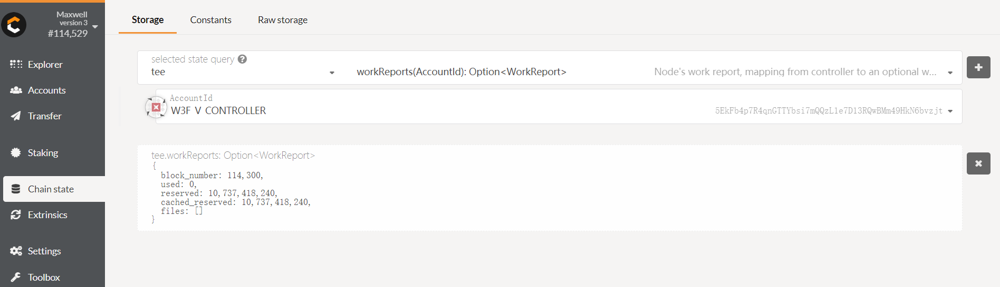

#### 4. Validator will be able to see its stake limit and valid stakes

> **NOTE**: Make sure you have already bonded your `Controller-Stash`, otherwise you cannot test this No.4 function.

**Use validator accounts in following steps.**

- `Stake Limit`: After the node uploads the work report, it can immediately see the change of the stake limit from Chain state in [Crust Apps](http://apps.crust.network/#/chainstate)
  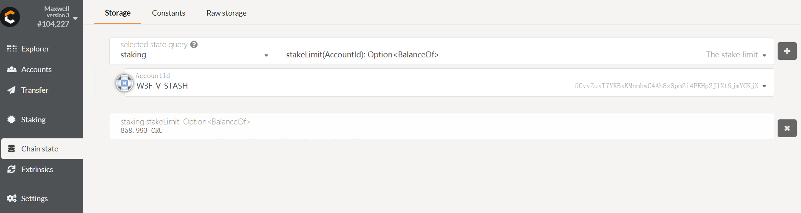
- `Valid Stake`: In each era, user can check the `ledger` API to get the `valid stakes` value's change from Chain state in [Crust Apps](http://apps.crust.network/#/chainstate):
  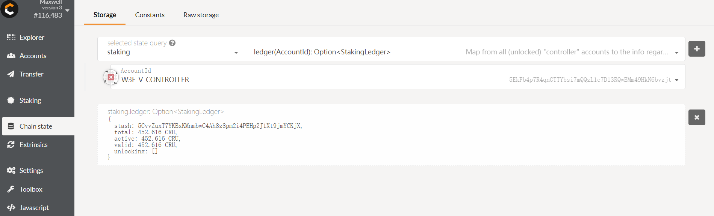

#### 5. Active check based on stake limit

- `validate`: If the user wants to become a validator after bonding, the stake limit > 0
  - Step0 - Make sure you are already **bonded**
  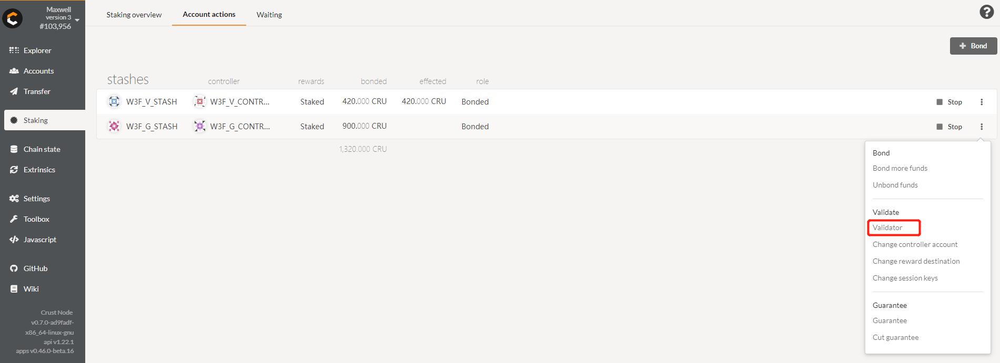
  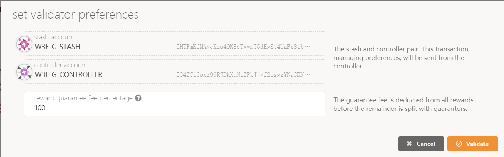
  - Step1 - When your `stake_limit == 0` and call `validate`, you will get `NoWorkloads` error (**Please use your guarantor accounts to test, because your validator accounts already have stake limit now.**)
  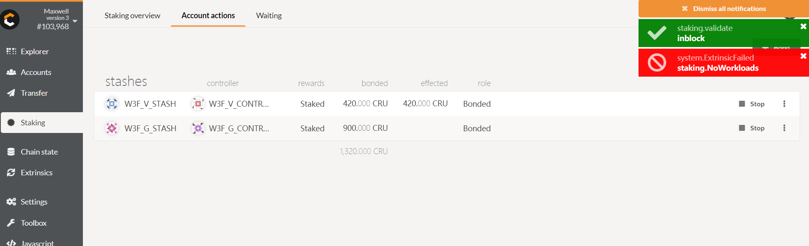
  - Step2 - When your `stake_limit > 0` and call `validate`, you will validate successfully (**You have already tested this function inside the Node Setup Manual**)
  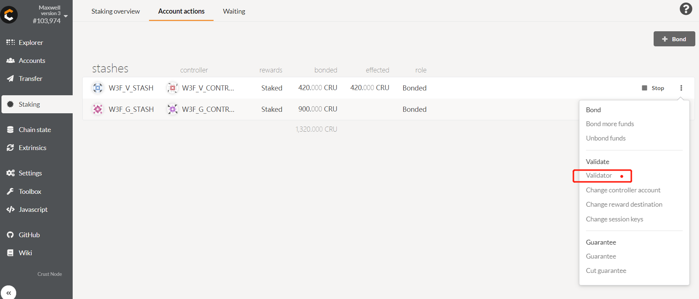
  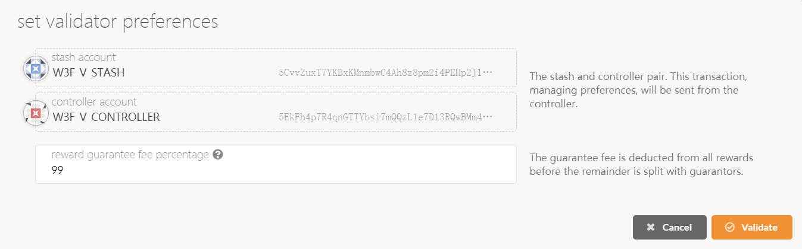
  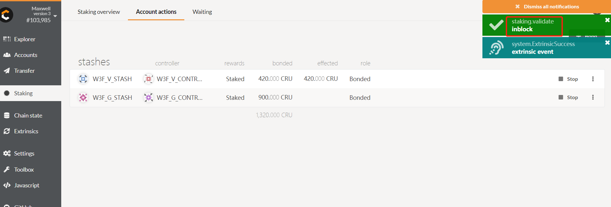

- `guarantee`: Guarantor guarantee amount cannot exceed the validator’s stake limit(***Please make sure you are using the gurantor accounts***)
  - Step0 - Make sure you are **already bonded**
  - Step1 - Call `guarantee`, and guaranteed stakes > remain_stakes(stake_limit - bonded_stakes)
  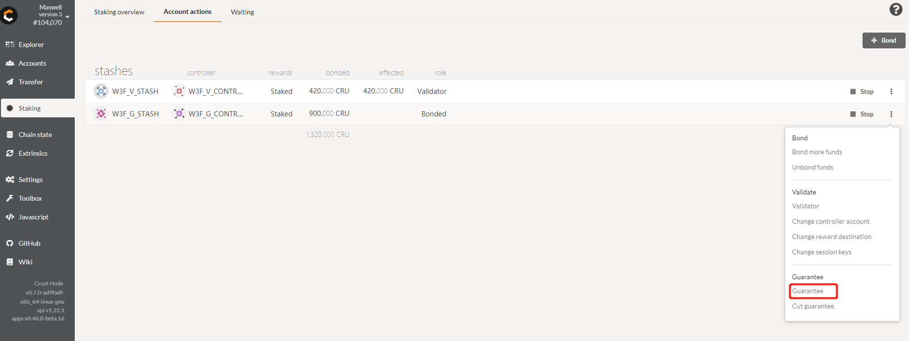
  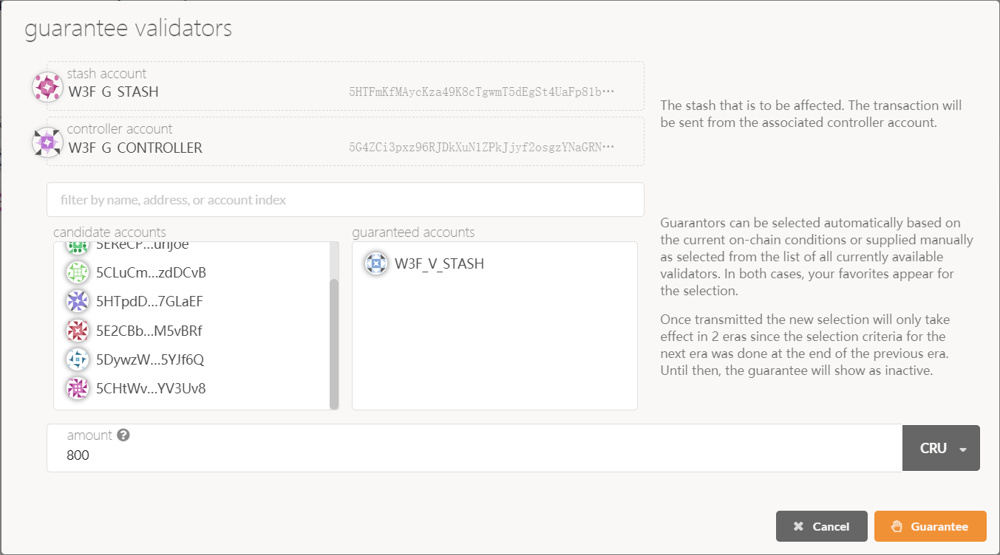
  - Step2 - You can see the `other stake` under `Staking` module in [Crust Apps](http://apps.crust.network/#/staking) after an era
  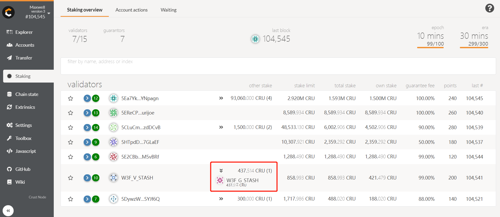

#### 6. Passive check based on stake limit

> Passive check happens at the begin of each era, mainly influences (validator + guarantor)'s `stakers` and `ledger.valid`.

- If validator's stake limit goes **larger**, nothing will happen
- If validator's stake limit goes **smaller**:
  - **Case1**: `stake_limit > validator_own_stakes` and `stake_limit < total_stakes`(validator's own stakes + guaranteed stakes).
    - Step 1: Cut `2 GB` storage volume, **Use validator accounts to run following command**:
    ```shell
    curl --location --request POST 'http://127.0.0.1:12222/api/v0/srd/change' --header 'backup: {"address":"5EHP5jLDdyNevsXhvJBwo18srU95ijYoWH42C4TqYPpmeVP7","encoded":"0xdfaabf5fda7c134549bc8a6fefe8cc3ff8bc6b1c3885ae50ec2e2f64cf20ebbbefd34c79715e4722443b205e62cfb9fd1bfca61e7cd036599a90587a7dd2d62f352abf9f3799dd7ce1853474cfe23cd5f9b4b6e999b338005bf98ee545b24515e22152a1923660876330f776fc5fad1f4e47ee147de6e2f087a038413aa6bd21519fb9bb19bbd193bcbe9b5fd40ad9508b0d82e93b2e56aeec7c84945c","encoding":{"content":["pkcs8","sr25519"],"type":"xsalsa20-poly1305","version":"2"},"meta":{"genesisHash":"0xa5bec4b73f15b4f6e99eee42778ab6754c90aeadcd2ae86aa79e9c5c7a55dd30","name":"W3F V Controller","tags":[],"whenCreated":1596619069134}}' --header 'Content-Type: application/json' --data-raw '{"change":-2}'
    ```
    - Step 2: **After 1 era**, you will see *Guarantor's Stake* reduced from `staker` API
    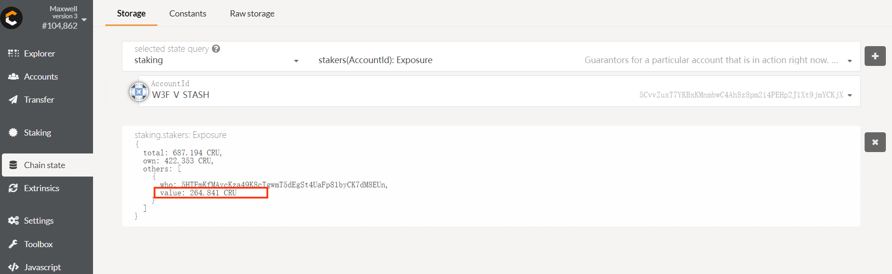
  - **Case2**: `stake_limit < validator_bonded_stakes`.
    - Step1: Continue to cut `5 GB` storage volume, **Use validator accounts to run following command**:
    ```shell
    curl --location --request POST 'http://127.0.0.1:12222/api/v0/srd/change' --header 'backup: {"address":"5EHP5jLDdyNevsXhvJBwo18srU95ijYoWH42C4TqYPpmeVP7","encoded":"0xdfaabf5fda7c134549bc8a6fefe8cc3ff8bc6b1c3885ae50ec2e2f64cf20ebbbefd34c79715e4722443b205e62cfb9fd1bfca61e7cd036599a90587a7dd2d62f352abf9f3799dd7ce1853474cfe23cd5f9b4b6e999b338005bf98ee545b24515e22152a1923660876330f776fc5fad1f4e47ee147de6e2f087a038413aa6bd21519fb9bb19bbd193bcbe9b5fd40ad9508b0d82e93b2e56aeec7c84945c","encoding":{"content":["pkcs8","sr25519"],"type":"xsalsa20-poly1305","version":"2"},"meta":{"genesisHash":"0xa5bec4b73f15b4f6e99eee42778ab6754c90aeadcd2ae86aa79e9c5c7a55dd30","name":"W3F V Controller","tags":[],"whenCreated":1596619069134}}' --header 'Content-Type: application/json' --data-raw '{"change":-5}'
    ```
    - Step2: **After 1 era**, you will see the *Guarantor* already been removed from `staker` API.
    

#### 7. Validator election algorithm

Validator Set will elect every era, you can check from Staking page in [Crust Apps](http://apps.crust.network/#/staking), they are ranking top down by their `total stake`.
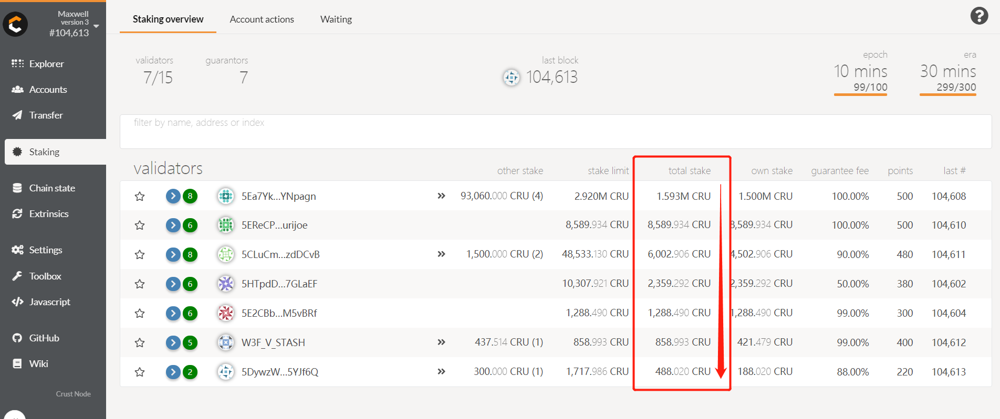

#### 8. Providing storage interface to store given file

> **Please prepare another machine as storage client under the same LAN**. In the following document, the running node is referred as "server", and the storage client is referred as "client". In this step, the client sends a file to the server, gets confirmation from the server, and finally the file gets stored on the server and the related infomation can be queried 
from blockchain through [Crust Apps](http://apps.crust.network). **Please use your guarantors accounts to prepare environment**.

The Karst module of Crust Maxwell 1.0 supports FastDFS as file storage and transport solution. IPFS will be supported in Maxwell 2.0 (by Oct.2020). Therefore FastDFS will be used in following step.

##### 8.1 Install FastDFS client and Karst client

- Prepare folder
  ```shell
  sudo mkdir -p /opt/fastdfs
  ```
  ```shell
  cd /opt/fastdfs
  ```
- Install `libfastcommon`
  - Step 1: Download
  ```shell
  sudo wget https://github.com/happyfish100/libfastcommon/archive/V1.0.43.tar.gz
  ```
  - Step 2: Unzip
  ```shell
  sudo tar -zxvf V1.0.43.tar.gz
  ```
  - Step 3: Compile and Install
  ```shell
  cd libfastcommon-1.0.43
  ```
  ```shell
  sudo ./make.sh
  ```
  ```shell
  sudo ./make.sh install
  ```
   Success if you get following info:
  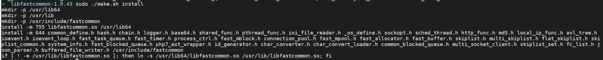
  - Step 4: Set symbol link
  ```shell
  sudo ln -s /usr/lib64/libfastcommon.so /usr/local/lib/libfastcommon.so
  sudo ln -s /usr/lib64/libfastcommon.so /usr/lib/libfastcommon.so
  sudo ln -s /usr/lib64/libfdfsclient.so /usr/local/lib/libfdfsclient.so
  sudo ln -s /usr/lib64/libfdfsclient.so /usr/lib/libfdfsclient.so
  ```
- Install `fastdfs`
  - Step 1: Download
  ```shell
  cd /opt/fastdfs
  ```
  ```shell
  sudo wget https://github.com/happyfish100/fastdfs/archive/V6.06.tar.gz
  ```
  - Step 2: Unzip
  ```shell
  sudo tar -zxvf V6.06.tar.gz
  ```
  - Step 3: Compile and Install
  ```shell
  cd fastdfs-6.06
  ```
  ```shell
  sudo ./make.sh
  ```
  ```shell
  sudo ./make.sh install
  ```
   Success if you get following info:
  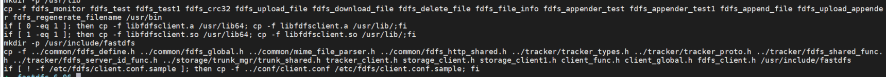
  - Step 4: Config
  ```shell
  cd /etc/fdfs
  ```
  ```shell
  sudo mkdir -p /home/web3/fastdfs/test
  ```
  ```shell
  sudo cp client.conf.sample client.conf
  ```
  ```shell
  sudo vim client.conf
  ```
  Change the `base_path` and `tracker_server` like the pic shows below, **Please change the `tracker_server`'s IP to your server IP**:
  
- Install `Karst`
  - Step 1: Run following command to pull Karst docker image. Or, you can follow the "Build" section above to build Karst docker image from source code.
  ```shell
  sudo docker pull crustio/karst:0.2.0
  ```
  - Step 2: Config
  ```shell
  cd /home/user
  ```
  ```shell
  vi config.json
  ```
  You need to edit your config file using the json below
  ```json
  {
    "base_url": "0.0.0.0:17000",
    "crust": {
      "address": "5EqajgoW3TWaSnPgo4LC2AJex2BF63zshaBSanCveSpeMaAN",
      "backup": "{\"address\":\"5EqajgoW3TWaSnPgo4LC2AJex2BF63zshaBSanCveSpeMaAN\",\"encoded\":\"0x54baecbfa6c35ccfdbaad49c28b8fb907984e5a8db430ebdda09296dc8090b92942e3b602cba44159954142ad15ffdfe0e2761de6dd6cabce72d9d54b0697785782f276e1713fc02abb276d3912d70f946d48afb3561f714e35ff45846b1ff0b7bf760b81928aa9fdaf9afcbce47460e46f0cbc6ce6098f3f17dafdd59a5d51221d2958257d7124694344f41b3fd76a095af5a0654fd3449cbbfdb951a\",\"encoding\":{\"content\":[\"pkcs8\",\"sr25519\"],\"type\":\"xsalsa20-poly1305\",\"version\":\"2\"},\"meta\":{\"genesisHash\":\"0xa5bec4b73f15b4f6e99eee42778ab6754c90aeadcd2ae86aa79e9c5c7a55dd30\",\"name\":\"W3F G Controller\",\"tags\":[],\"whenCreated\":1596619123432}}",
      "base_url": "[Server IP Address]:56666/api/v1",
      "password": "123"
    },
    "fastdfs": {
      "max_conns": 100,
      "tracker_addrs": ["127.0.0.1:22122"]
    },
    "log_level": "debug",
    "tee_base_url": ""
  }
  ```
  Please change `[Server IP Address]` to your server's address and make sure `56666` is open.
  - Step 3: Run
  ```shell
  sudo docker run -it -v /home/user/:/karst -e INIT_ARGS="-c /karst/config.json" --name karst --network host crustio/karst:0.2.0
  ```

##### 8.2 Put file and place storage order

- Step 1: New `test.file`
  ```shell
  cd /home/user
  ```
  ```shell
  head -c 800000 /dev/urandom >> test.file
  ```
- Step 2: Split file
  ```shell
  sudo docker exec -it karst /bin/bash -c 'karst split /karst/test.file /karst'
  ```
- Step 3: Check the result and record the hash value
  ```shell
  "merkle_tree":"{\"hash\":\"32c5acdce8b26a2854388138bdb812f588fd783246dd00fbcdbf5fb1ecc3abd1\",\"size\":800000,\"links_num\":1,\"links\":[{\"hash\":\"5c9c53d767ff846d539d06f2d61318b1cd4e7b0ecfdc3e6ab02706e4d9fe8552\",\"size\":800000,\"links_num\":0,\"links\":[],\"stored_key\":\"\"}],\"stored_key\":\"\"}"
  ```
- Step 4: In the /home/user folder, you will see the splited folder
  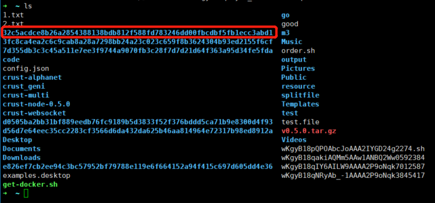
- Step 5: You can send the splited files to FastDFS
  ```shell
  fdfs_upload_file /etc/fdfs/client.conf /home/user/32c5acdce8b26a2854388138bdb812f588fd783246dd00fbcdbf5fb1ecc3abd1/0_5c9c53d767ff846d539d06f2d61318b1cd4e7b0ecfdc3e6ab02706e4d9fe8552
  ```
  and get a returned path `group1/M00/00/36/wKgyB18qaJOAQ_wsAAw1ANBQ2Ww8836968`

- Step 6: Fill the `stored_key`(PATH value) with above *returned path*. Then declare the file to chain and request provider to generate store proof
  ```shell
  sudo docker exec -it karst /bin/bash -c 'karst declare "{\"hash\":\"32c5acdce8b26a2854388138bdb812f588fd783246dd00fbcdbf5fb1ecc3abd1\",\"size\":800000,\"links_num\":1,\"links\":[{\"hash\":\"5c9c53d767ff846d539d06f2d61318b1cd4e7b0ecfdc3e6ab02706e4d9fe8552\",\"size\":800000,\"links_num\":0,\"links\":[],\"stored_key\":\"group1/M00/00/36/wKgyB18qaJOAQ_wsAAw1ANBQ2Ww8836968\"}],\"stored_key\":\"\"}" 60 5EHP5jLDdyNevsXhvJBwo18srU95ijYoWH42C4TqYPpmeVP7'
  ```
- Step 7: It will return a storage order id from chain
  ```shell
  [INFO] 2020/08/05 08:10:54 {"info":"Declare successfully in 4.281581829s ! Store order hash is '0x9fc854d7372a753a3d337986ae3e57b1613f36d4ba9285092f0928fb1425bd8a'.","store_order_hash":"0x9fc854d7372a753a3d337986ae3e57b1613f36d4ba9285092f0928fb1425bd8a","status":200}
  ```
- Step 8: **After 1 era**, you can see the work report now contains the file hash `32c5acdce8b26a2854388138bdb812f588fd783246dd00fbcdbf5fb1ecc3abd1`
  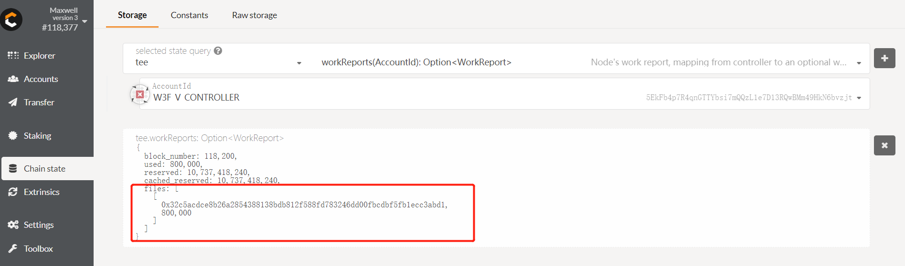

##### 8.3 Get file from server

- Step 1: Get file storage info
  ```shell
  sudo docker exec -it karst /bin/bash -c 'karst obtain 32c5acdce8b26a2854388138bdb812f588fd783246dd00fbcdbf5fb1ecc3abd1 5EHP5jLDdyNevsXhvJBwo18srU95ijYoWH42C4TqYPpmeVP7'
  ```
  It will return a FastDFS download path
  ```shell
  [INFO] 2020/08/05 08:14:00 {"info":"Obtain '32c5acdce8b26a2854388138bdb812f588fd783246dd00fbcdbf5fb1ecc3abd1' from '5EHP5jLDdyNevsXhvJBwo18srU95ijYoWH42C4TqYPpmeVP7' successfully in 37.046923ms !","merkle_tree":"{\"hash\":\"32c5acdce8b26a2854388138bdb812f588fd783246dd00fbcdbf5fb1ecc3abd1\",\"size\":800000,\"links_num\":1,\"links\":[{\"hash\":\"5c9c53d767ff846d539d06f2d61318b1cd4e7b0ecfdc3e6ab02706e4d9fe8552\",\"size\":800000,\"links_num\":0,\"links\":[],\"stored_key\":\"group1/M00/00/36/wKgyB18qakiAQMm5AAw1ANBQ2Ww0592384\"}],\"stored_key\":\"\"}","status":200}
  ```
- Step 2: Copy the `stored_key`, and run the following command to download the file to client.
  ```shell
  fdfs_download_file /etc/fdfs/client.conf group1/M00/00/36/wKgyB18qakiAQMm5AAw1ANBQ2Ww0592384
  ```