# Crust Network Milestone Deliverables

## Open Source Repos

- [Crust](https://github.com/crustio/crust/tree/w3f/m1)  
  The chain node which implement Crust protocol based on substrate.
- [Crust TEE](https://github.com/crustio/crust-tee/tree/w3f/m1)  
  The quantitative layer(storage and computation resources) based on TEE technology.
- [Crust API](https://github.com/crustio/crust-api/tree/w3f/m1)  
  The middleware layer connecting TEE and Chain Node.
- [Crust Client](https://github.com/crustio/crust-client/tree/w3f/m1)  
  The client management tool for installing and operating whole Crust App(including Crust, Crust TEE, Storage(IPFS) and Crust API).
- [Crust Apps](https://github.com/crustio/crust-apps/tree/w3f/m1)
  A Portal into the Crust network based on [@polkadot/apps](https://github.com/polkadot-js/apps). Provides a view and interaction layer from a browser.

## M1 Deliverables

| Number | Deliverable                                                                                                                                                                                            | Link                                                                                                                     | Notes                                                                                                                                                                            |
|--------|--------------------------------------------------------------------------------------------------------------------------------------------------------------------------------------------------------|--------------------------------------------------------------------------------------------------------------------------|----------------------------------------------------------------------------------------------------------------------------------------------------------------------------------|
| 1      | Users will be able to **check Crust nodes' empty and meaningful storage volume and status** through Crust explorer.                                                                                    | [Look through Work report](#1-look-through-work-report)                                                                                                 | MPoW-1: work report runtime module to quantify storage volume and monitor storage status.                                                                                        |
| 2      | Users will be able to **see nodes' TEE identity** through Crust explorer.                                                                                                                              | [Look through TEE Identity](#2-look-through-tee-identity)                                                                                                | MPoW-2: TEE (SGX solution) node onboarding and on-chain verification, nodes with SGX CPU can join Crust network                                                                  |
| 3      | Once nodes’ physical storage space changes, node owners will be able to **see nodes' storage volume automatically changes next era** through Crust explorer.                                           | [Dynamic storage change](#3-look-through-work-reports-change-when-increasing-or-reducing-storage-volumn)                                                                     | MPoW-3: dynamic storage scaling feature (including both empty and meaningful storage) to improve network availability                                                            |
| 4      | Users will be able to **check nodes’ (both validators and candidates) stake limit and valid stake** through Crust explorer.                                                                            | [Look through stake limit and valid stake](#4-validator-will-be-able-to-look-through-his-stake-limit-and-valid-stakes)                                                                                 | GPoS-1: Implement the feature to set stake limitation based on storage volume reported by MPoW work report.                                                                      |
| 5      | Users will not be able to **stake/vote exceed any node’s staking limit at any time**, and a node will **not be able to become a validator with no stake limit** claimed.                               | [Active check](#5-active-check-based-on-stake-limit)                                                            | GPoS-2: Implement active stake check based on validators and guarantors’ actions                                                                                                 |
| 6      | Users should be able to **see validator's stake limit (maybe) changed** and so his **valid stake  and his guarantor's valid stake (maybe) changed in each new era begins** through Crust explorer.     | [Passive check](#6-passive-check-based-on-stake-limit) | GPoS-3: Implement passive stake check. At the end of each era, while nodes’ stake limit could be changed according to factors like whole network storage volume and local volume |
| 7      | Users will be able to **see validator set changes(from stakes high to low order) at each era** through Crust explorer.                                                                                 | [Validator election algorithm](#7-validator-election-algorithm)                     | GPoS-4: Implement validator set election algorithm, it selects validators from high to low according to the nodes’ total stakes.                                                 |
| 8      | Users will be able to **get/put files through Crust AlphaNet’s IPFS interfaces**. In addition, users will be able to **see the meaningful storage volume changes** accordingly through Crust explorer. | [Provide IPFS interface to store meaningful file](#8-providing-ipfs-interface-to-store-meaningful-file)              | Storage-1: Provide basic meaningful storage capabilities. Storage API will be finalized in M2. In M1 Crust AlphaNet will provide basic IPFS interfaces.                          |
| 9 | Finish **technical white paper** and publish on Crust website |  [Technical white paper](https://crust.network/whitePaper) | Documentation-1 |
| 10 | Provide **wiki** on how to explore Alphanet on GitHub. | [Crust Alphanet Wiki](https://github.com/crustio/crust/wiki/Join-Crust-Alphanet) | Documentation-2 |
| 11 | Provide a basic **Github action** including building and testing on Ubuntu in crustio/crust repo | [Crust Github Action](https://github.com/crustio/crust/actions) | Open Source-1 |
| 12 | Provide a basic **Jenkins webhook** including building and testing on Ubuntu in crustio/crust-tee repo | [Crust TEE Jenkins CI](http://cicd.crust.run:7080/job/crust-tee/job/master/) | Open Source-2 |
| 13 | Provide a basic **Github action** including building on Ubuntu in crustio/crust-api repo | [Crust API Github Action](https://github.com/crustio/crust-api/actions?query=workflow%3A%22Yarn+CI%22) |Open Source-3

## Testing Guide

### 1. Preparing

1. Hardware requirements

    CPU must contain **SGX module**, and make sure the SGX function is turned on in the bios, please click [this page](https://github.com/crustio/crust/wiki/Check-TEE-supportive) to check if your machine supports SGX.

2. OS requirements: `Ubuntu 16.04`
  
3. Other setups
   - **Secure Boot** in BIOS needs to be turned off
   - Please use ordinary account, **do NOT support root account**

4. Install dependencies

    ```shell
    sudo apt install build-essential
    sudo apt install git
    sudo apt install libboost-all-dev
    sudo apt install openssl
    sudo apt install libssl-dev
    sudo apt install curl
    sudo apt install libelf-dev
    sudo apt install libleveldb-dev
    ```

### 2. Compile and Package

#### 2.1 Chain Node

1. Compile

    ```shell
    git clone https://github.com/crustio/crust.git
    cd crust
    git checkout w3f/m1
    cargo build --release
    ```

2. Package and generate `crust.tar`

    ```shell
    ./scripts/package.sh
    ```

#### 2.2 Crust TEE

> The `compilation and installation` of Crust TEE module is very closely related to the **hardware**, so even if there are detailed steps and scripts, there is *a possibility of error*. If an unknown error occurs during this process, please contact the Crust team in time to help solve.

1. Compile

    ```shell
    git clone https://github.com/crustio/crust-tee.git
    cd crust-tee
    git checkout w3f/m1
    ```

2. Add dependencies
    > This step is for importing TEE's C++ dynamic libraries and `IPFS` execution file, this will let TEE module easily communicate with `IPFS`.

    - Download [files.tar](https://drive.google.com/file/d/1Z6kNbnBU0sF4GdTeJ6i39P99UUATeppn/view?usp=sharing)
    - Unpack `files.tar`, you will get `files` folder
        ```
        - bin/
        - crust-alphanet/
        - crust-subkey
        - resource/
        ```
    - Copy `bin/` and `resource/` folder under `crust-tee` project folder

3. Pacakge

    ```shell
    ./scripts/package.sh
    ```

#### 2.3 Crust API

1. Compile

    ```shell
    git clone https://github.com/crustio/crust-api.git
    cd crust-api
    git checkout w3f/m1
    yarn
    ```

2. Package and generate `crust-api.tar`

    ```shell
    ./scripts/package.sh
    ```

### 3. Install Crust

- Clone Crust Client

    ```shell
    git clone https://github.com/crustio/crust-client.git
    cd crust-client
    git checkout w3f/m1
    ```

- Add dependencies
  - Create new folder named `resource`
  - Unpack `files.tar` like `2.2.2` does
  - Copy `crust-subkey` under `resource` folder
  - Move `crust.tar`, `crust-tee-0.3.0.tar` and `crust-api.tar` generated before into `resource` folder
  - Change `crust-tee-0.3.0.tar` to `crust-tee.tar`

- Install

    ```shell
    sudo ./install.sh
    ```

### 4. Run Crust

#### Mode 1 - Run as genesis

- Unpack `files.tar` like `2.2.2` does
- `cd files/crust-alphanet`, you can see a default `genesis1_config` as a genesis validator role
- Run `./start.sh` to start genesis node(make sure you already under `crust-alphanet` folder)
- Run `tail -f logs/genesis1_chain.log`, monitoring chain node's status, waiting for stability blocking show below: 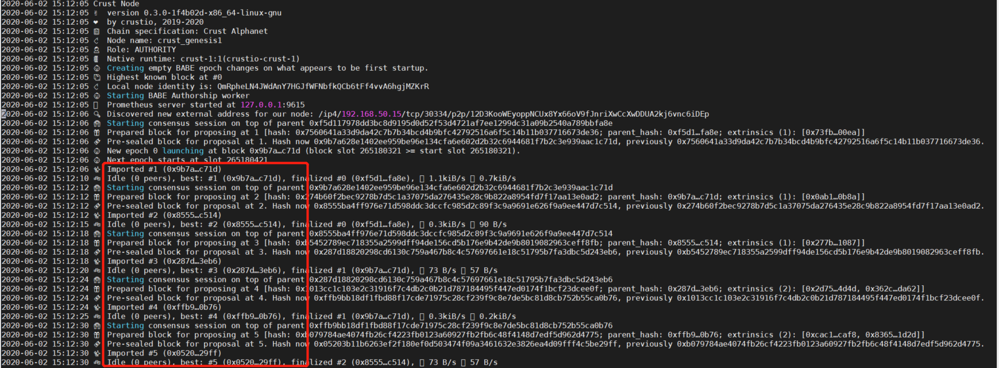
- Run `tail -f logs/genesis1_tee.log`, monitoring tee's status, make sure you see the log printed like below: 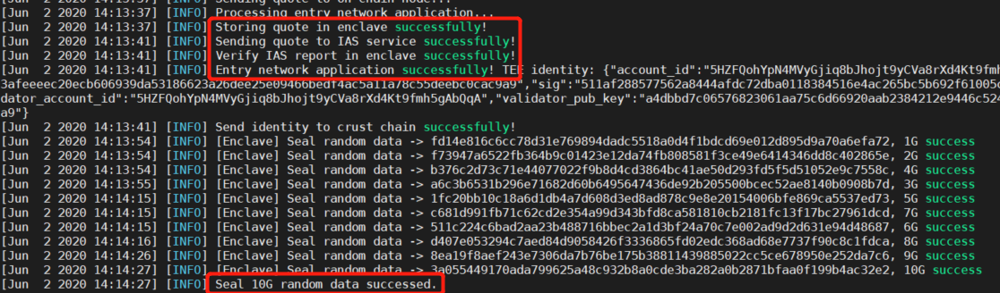

#### Mode 2 - Run as watcher(Read Only Node)

- Unpack `files.tar` like `2.2.2` does
- `cd files/crust-alphanet`
- Run `./watcher.sh`

#### Mode 3 - Run as validator

> Under the `files/crust-alphanet` contains `validator1_config` and `validator2_config`, this is 2 default validator configs, you can use these to avoid additional configuration work.

1. Run Chain Node

    > Start using default `validator1_config`, you can run another validator using `validator2_config`.

    - Start using `crust-client`(make sure you're under `files/crust-alphanet` folder)

        ```shell
        crust-client chain-launch-validator validator1_config/chain-launch.config -b logs/validator1-chain.log
        ```

    - Run `tail -f logs/validator1_chain.log`, monitoring chain node's status，see logs like below means started successful 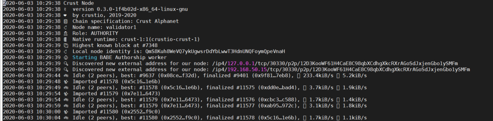
    - Get `session key` like [Polkadot](https://wiki.polkadot.network/docs/en/maintain-guides-how-to-validate-kusama#generating-the-session-keys)

2. Bond accounts(with Crust Apps)

   - Create 2 accounts(controller and stash)
    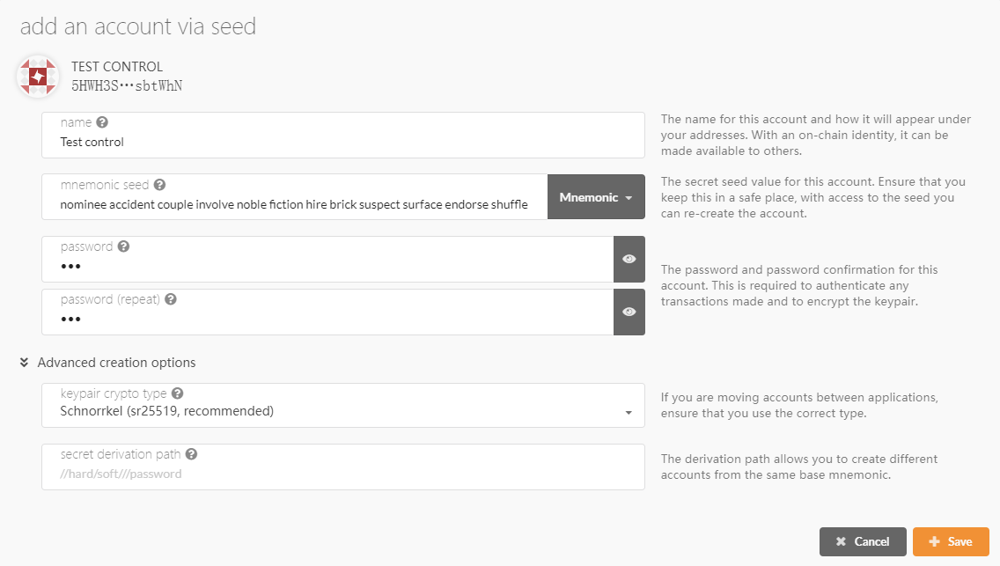
    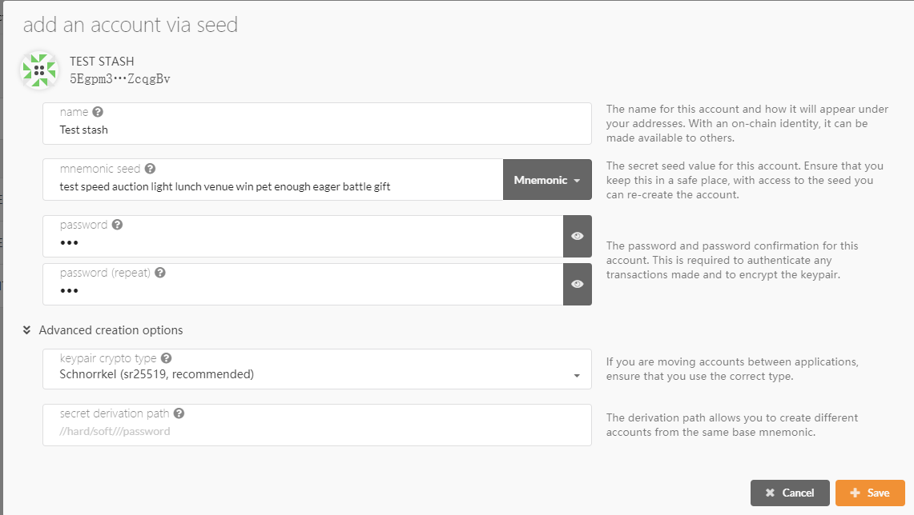
   - Transfer some `CRUs` to them
    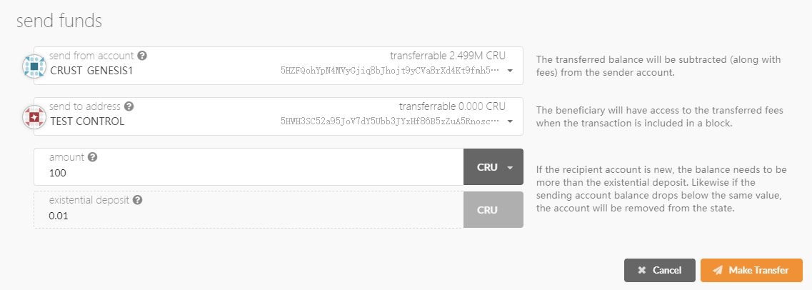
   - Bond two account and set session key
    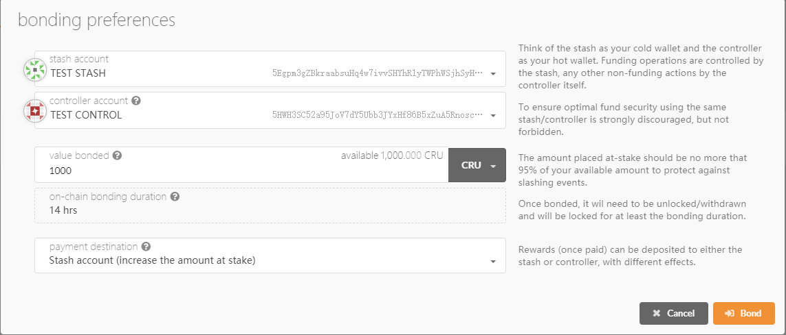
    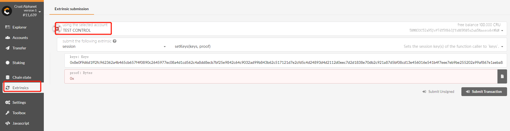

3. Run Crust API

   - Start with `crust-client`(make sure you're under `files/crust-alphanet` folder)

       ```shell
       crust-client api-launch validator1_config/api-launch.config -b logs/validator1-api.log
       ```

   - Run `tail -f logs/validator-api.log`, monitoring API's running status, see logs like below means started successful: 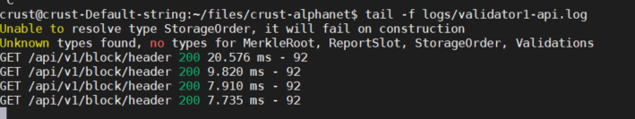
   - Run `curl --location --request GET 'http://localhost:56670/api/v1/block/header'` to test if API runs well: 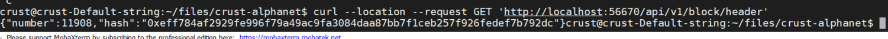

4. Run IPFS

   - Start with `crust-client`(make sure you're under `files/crust-alphanet` folder)

    ```shell
    crust-client ipfs-launch validator1_config/ipfs-launch.config -b logs/validator1_ipfs.log
    ```

   - Run `tail -f logs/validator1_ipfs.log`, monitoring IPFS's running status, see logs like below means started successful: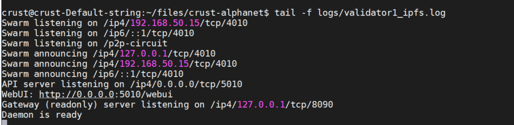

5. Run TEE

   - Configuration
     - Using `files/crust-subkey inspect "chain_address"` to get `chain_account_id`(you need to remove the '0x' prefix) when fillin this value into TEE config(`chain_address` needs to be the bonded `controller's address`): 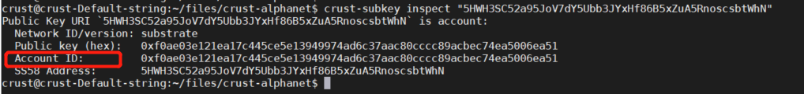
     - Change **chain_account_id**, **chain_address**, account's **chain_backup**(JSON to string) and account's **chain_password** inside `files/crust-alphanet/validator1_config/tee-launch.json` file 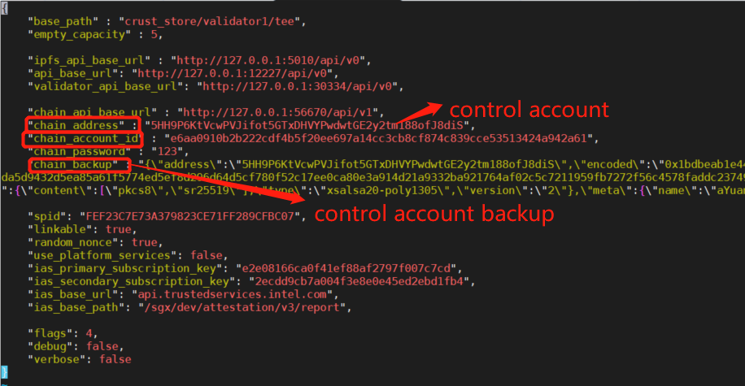

   - Start with `crust-client`

       ```shell
       crust-client tee-launch validator1_config/tee-launch.json -b logs/validator1_tee.log
       ```

   - Run `tail -f logs/validator1_tee.log`, monitoring TEE's running status, **you need to wait for TEE reporting works successfully** shows below: 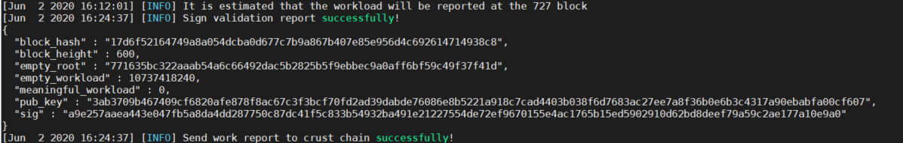

6. Validate

   - Check work report through `Crust Apps`: 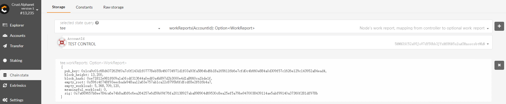
   - Validate through `extrinsics` panel in `Crust Apps`: 
   - Now you can wait an era to see `Validator1` has been elected as validator

### 5. Test M1 deliverables

#### 1. Look through work report

- Step1 - [Start genesis node](#mode-1---run-as-genesis)
- Step2 - Run `tail -f logs/genesis1_tee.log`, monitoring TEE's running status until print **works reported** info shows below:   
- Step3 - You can look through the work report from `Chain state` in `Crust Apps` 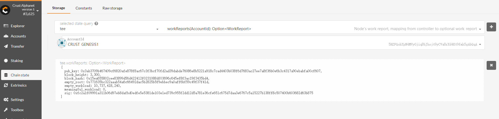

#### 2. Look through TEE identity

- Step1 - [Start genesis node](#mode-1---run-as-genesis) 
- Step2 - Run `tail -f logs/genesis1_tee.log`, monitoring TEE's running status until print **identity** info shows below: 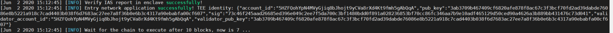  
- Step3 - You can look through the work report from `Chain state` in `Crust Apps` 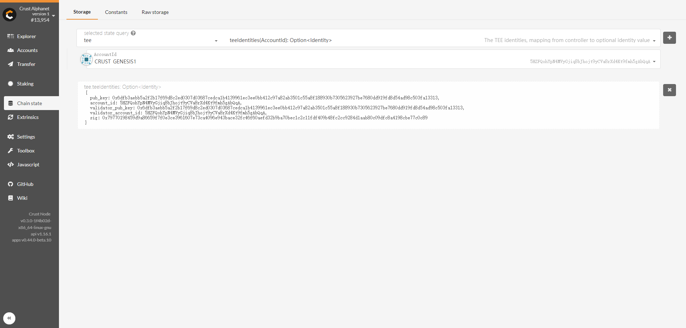

#### 3. Look through Work report's change when increasing or reducing storage volumn

- Increasing storage  
  - Step1 - Look through current work report 
  - Step2 - Run command below to increase 10GB storage

  ```shell
  curl --location --request POST 'http://127.0.0.1:12222/api/v0/change/empty' \
  --header 'backup: {"address":"5FqazaU79hjpEMiWTWZx81VjsYFst15eBuSBKdQLgQibD7CX","encoded":"0xc81537c9442bd1d3f4985531293d88f6d2a960969a88b1cf8413e7c9ec1d5f4955adf91d2d687d8493b70ef457532d505b9cee7a3d2b726a554242b75fb9bec7d4beab74da4bf65260e1d6f7a6b44af4505bf35aaae4cf95b1059ba0f03f1d63c5b7c3ccbacd6bd80577de71f35d0c4976b6e43fe0e1583530e773dfab3ab46c92ce3fa2168673ba52678407a3ef619b5e14155706d43bd329a5e72d36","encoding":{"content":["pkcs8","sr25519"],"type":"xsalsa20-poly1305","version":"2"},"meta":{"name":"Yang1","tags":[],"whenCreated":1580628430860}}' \
  --header 'Content-Type: application/json' \
  --data-raw '{
   "change":20
  }'
  ```

  - Step3 - You can look through the new work report from `Chain state` in `Crust Apps` 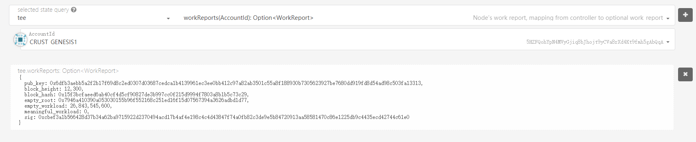

- Reducing storage
  - Step1 - Look through current work report 
  - Step2 - Run command below to reducing 10GB storage

    ```shell
    curl --location --request POST 'http://127.0.0.1:12222/api/v0/change/empty' \
    --header 'backup: {"address":"5FqazaU79hjpEMiWTWZx81VjsYFst15eBuSBKdQLgQibD7CX","encoded":"0xc81537c9442bd1d3f4985531293d88f6d2a960969a88b1cf8413e7c9ec1d5f4955adf91d2d687d8493b70ef457532d505b9cee7a3d2b726a554242b75fb9bec7d4beab74da4bf65260e1d6f7a6b44af4505bf35aaae4cf95b1059ba0f03f1d63c5b7c3ccbacd6bd80577de71f35d0c4976b6e43fe0e1583530e773dfab3ab46c92ce3fa2168673ba52678407a3ef619b5e14155706d43bd329a5e72d36","encoding":{"content":["pkcs8","sr25519"],"type":"xsalsa20-poly1305","version":"2"},"meta":{"name":"Yang1","tags":[],"whenCreated":1580628430860}}' \
    --header 'Content-Type: application/json' \
    --data-raw '{
    "change":-10
    }'
    ```

  - Step3 - You can look through the **new work report** from `Chain state` in `Crust Apps` 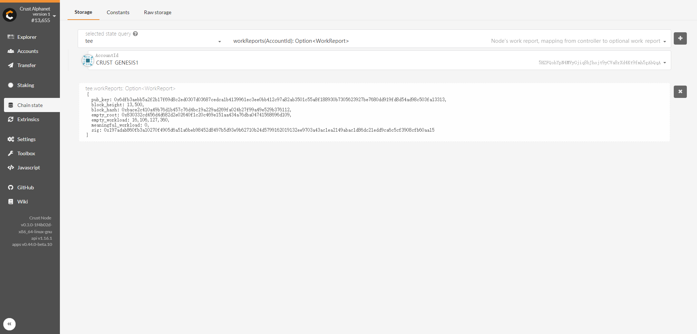

#### 4. Validator will be able to look through his stake limit and valid stakes

> Make sure you have already been a validator, otherwise you cannot fully test this No.4 functions

- After the node uploads the work report, it can immediately see the change of the stake limit: 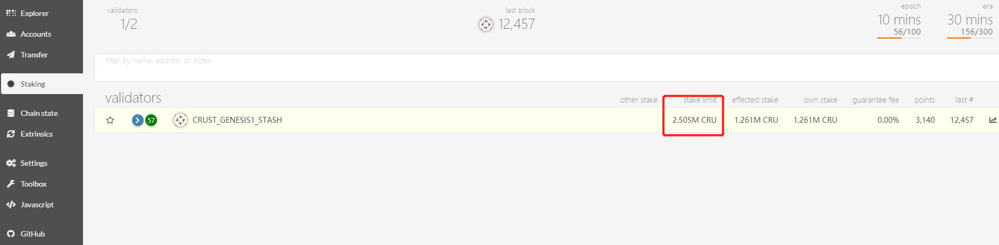
- In each era, user can check the `ledger` API through `Chain state` to get the `valid stakes` value's change: 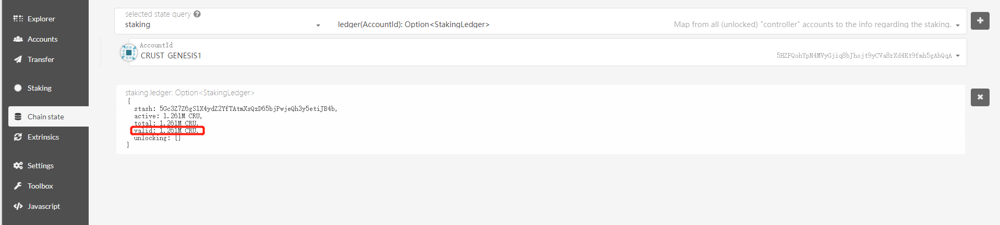

#### 5. Active check based on stake limit

- `validate`: If the user wants to become a validator after bonding, the stake limit > 0
  - Step0 - Make sure you are already **bonded**
  - Step1 - When your `stake_limit == 0` and call `validate` extrinsic, you will get `NoWorkloads` error 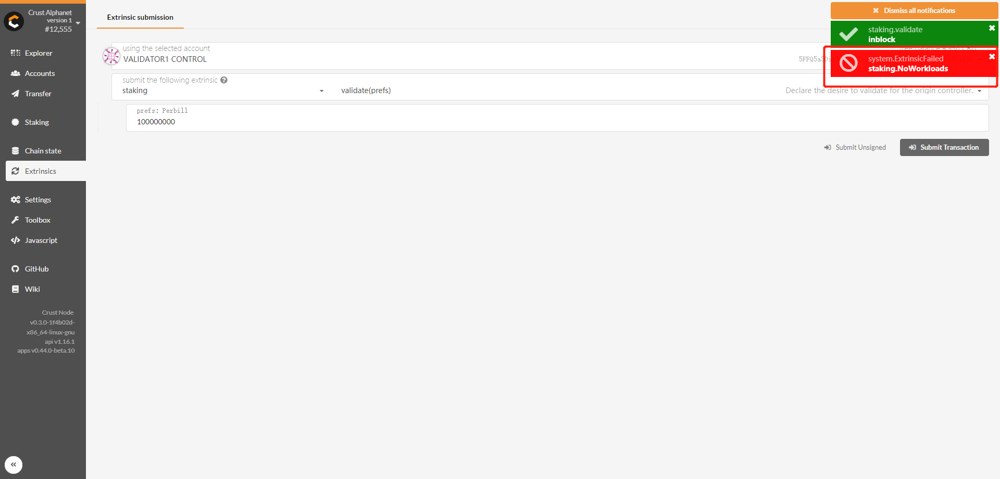
  - Step2 - When your `stake_limit > 0` and call `validate` extrinsic, you will validate successfully 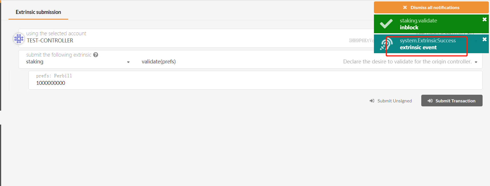

- `bond_extra`: If a validator wants to bond extra stakes, no more than the stake limit
  - Step0 - Make sure you are already be a validator
  - Step1 - Bond extra stakes > remain stakes(`remain_stakes = stake_limit - bonded_stakes`): 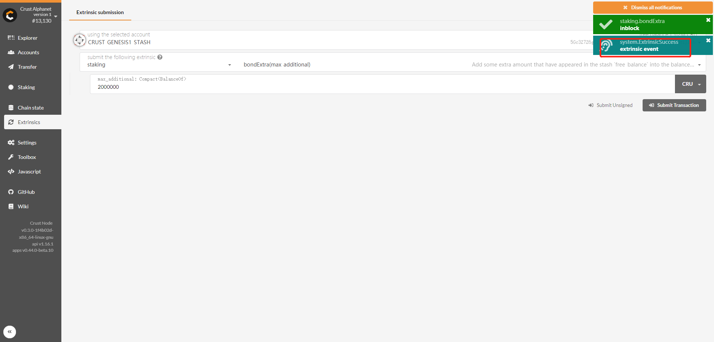
  - Step2 - You can check the `ledger` API through `Chain state` to get the `total` value will be the `stake_limit`: 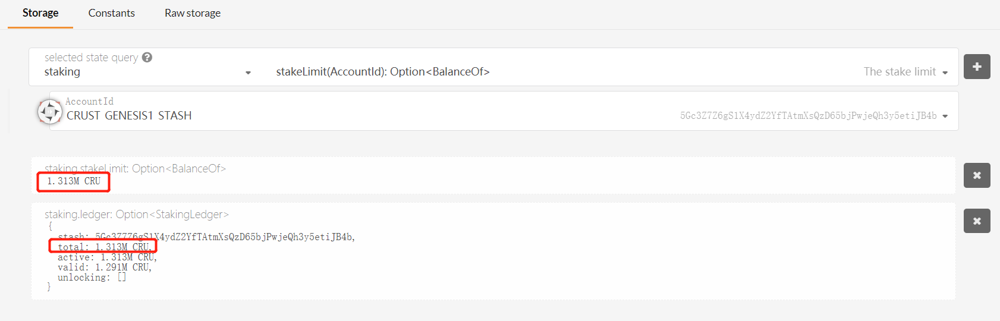

- `guarantee`: Guarantor guarantee amount cannot exceed the validator’s stake limit
  - Step0 - Make sure you are **already bonded**
  - Step1 - Call `guarantee` under `Extrinsic` module in `Crust Apps`, and guaranteed `Balance` > remain_stakes(stake_limit - bonded_stakes): 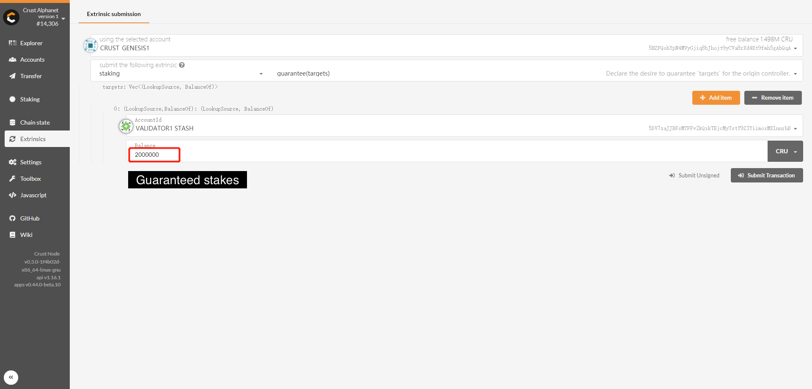
  - Step2 - You can see the `other stake` under `Staking` module in `Crust Apps` after an era: 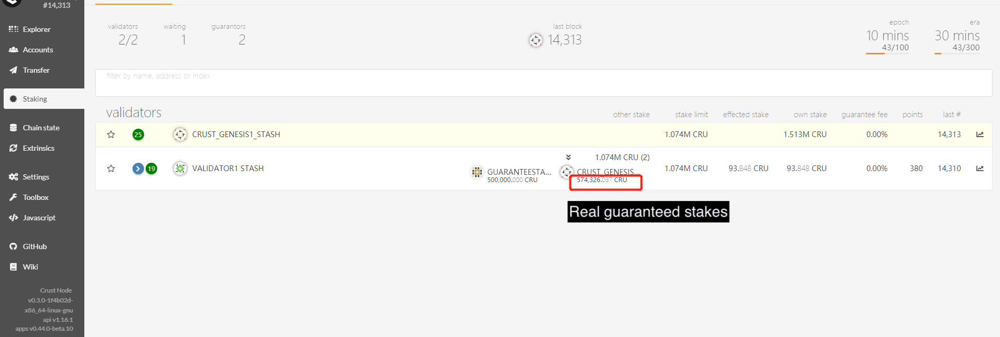

#### 6. Passive check based on stake limit

> Passive check happens at the begin of each era, mainly influent (validator + guarantor)'s `stakers` and `ledger.valid`.

- If validator's stake limit goes **larger**, nothing will happen
- If validator's stake limit goes **smaller**:
  - `stake_limit > validator_bonded_stakes` and `stake_limit < total_stakes`(validator's bonded stakes + guaranteed stakes). Then:
    - Guarantors will get influented, you can check `ledger.valid` through `Chain state` in `Crust Apps`
    - Validator's `staker` will get influented, you can check through `Chain state` in `Crust Apps`
  - `stake_limit < validator_bonded_stakes`. Then:
    - Guarantors will get influented, you can check `ledger.active` through `Chain state` in `Crust Apps` 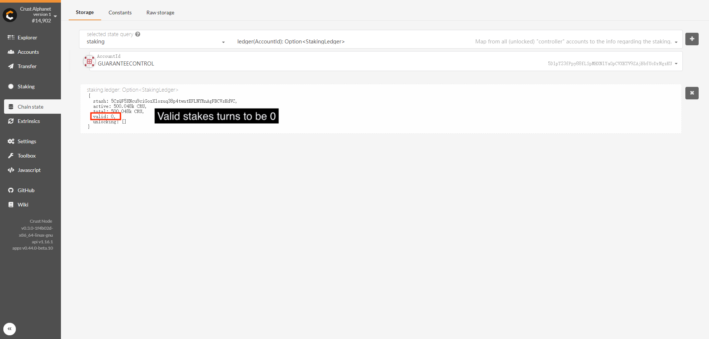
    - `target`(this validator) will be removed from guarantor, you can check `guarantor` through `Chain state` in `Crust Apps` 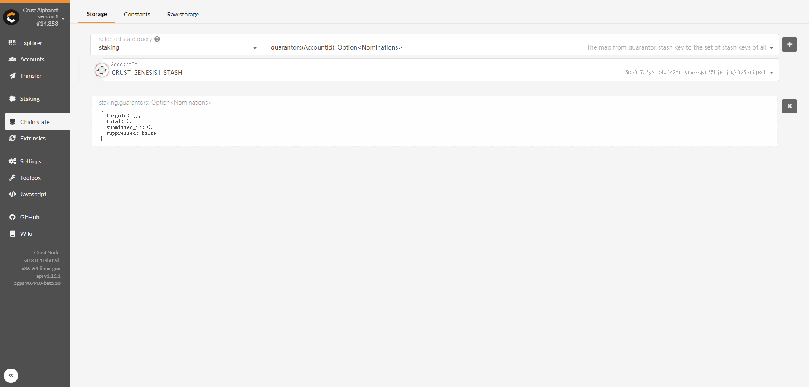
    - Validator's `staker` will get influented, you can check through `Chain state` in `Crust Apps` 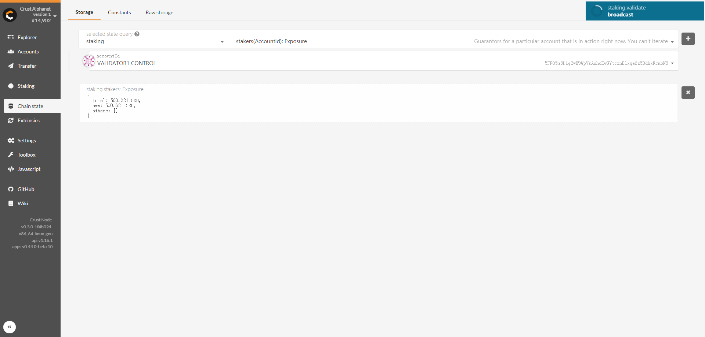
    - Validator's `ledger.valid` will get influented, you can check through `Chain state` in `Crust Apps` 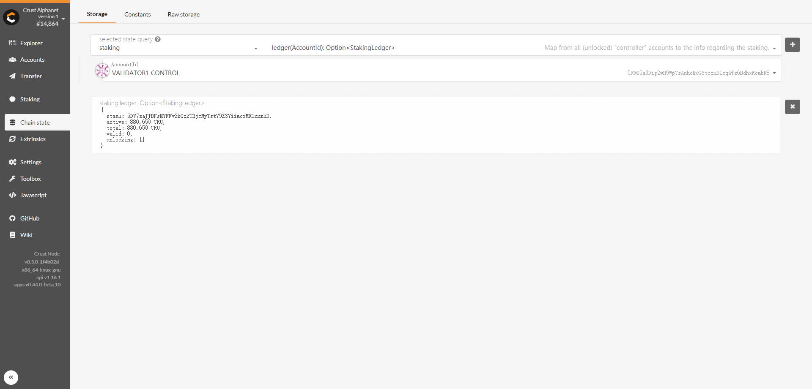

#### 7. Validator election algorithm

> Let's suppose our test chain has 4 validators, and there is at least 1 validator(minimum_validator_count).

- Step1 - The initial network has only one genesis node A, and the total_stakes_A (A bonded stakes + guaranteed stakes) , then you will get VS(validator set) = { A } through `current_elected` under `Chain state` in `Crust Apps` :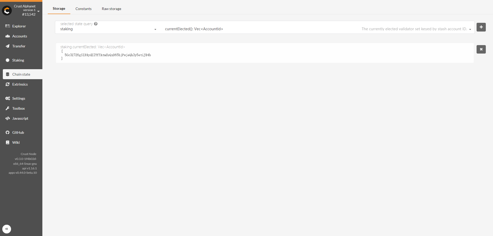
- Step2 - Then, join the validator B and validator C,total_stakes_B > total_stakes_C ;
- Step3 - After 1 era+1 session，you can see VS = { A, B };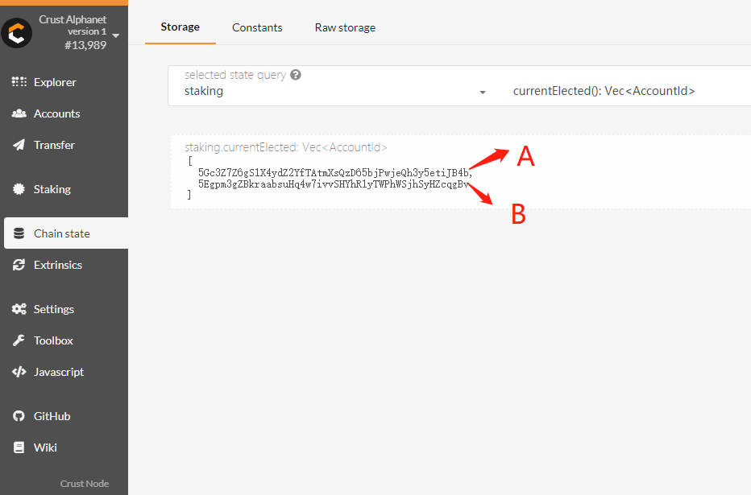
- Step4(Optional) - Increasing total_stakes_A up to more than B, after 1 era+1 session, VS = { A, C } 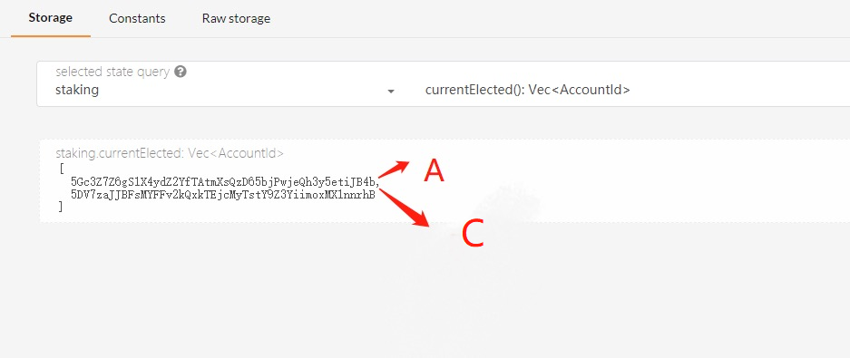

#### 8. Providing IPFS interface to store meaningful file

- Users can **put a file through the local IPFS interface**. After the **work report of 1 era** is reported, the user can see that **the meaningful workload in the Work Report** has changed
  - Step1 - Put file through IPFS interface

  ```shell
  curl -F "file=@/home/crust/crust-alphanet/start.sh" 127.0.0.1:5002/api/v0/add
  ```

  - Step2 - After an era, you can check `WorkReport.meaningful_workload` through `Chain state` in `Crust Apps` 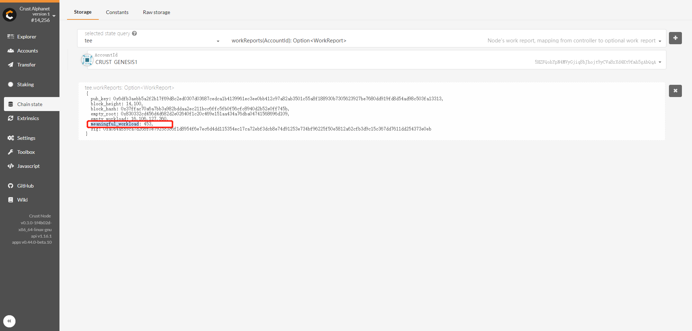

- Users can **get an existing file** in the network through the local IPFS interface
  - Step1 - Get existing file through IPFS interface

  ```shell
  curl -X POST "http://127.0.0.1:5002/api/v0/cat?arg=Qmb75M5d2ZA3pNi16T18u6ubVASkteb1BtF1yykCmnC5o4" > 1.txt
  ```

  - Step2 - Check file has been downloaded 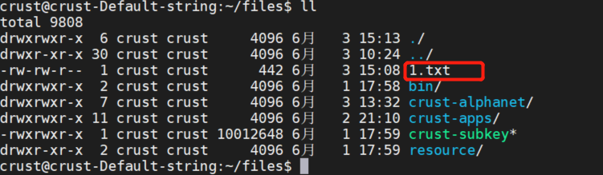